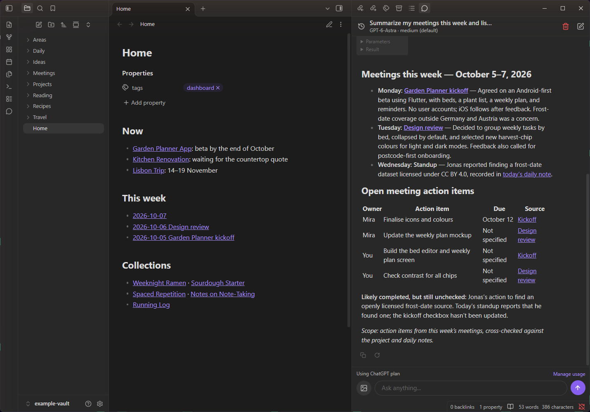
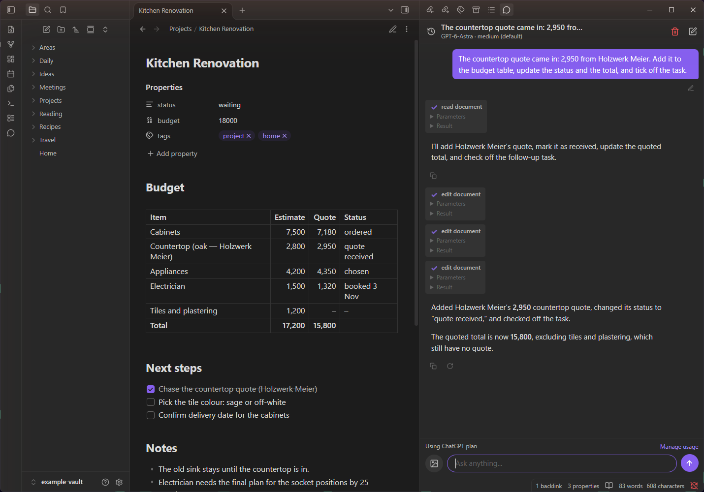
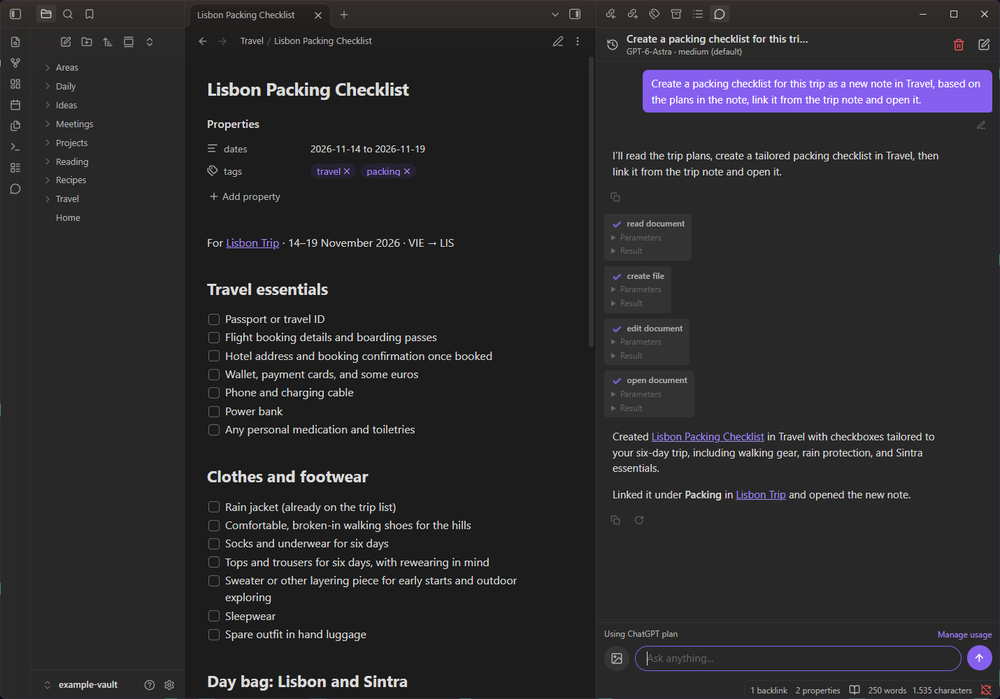
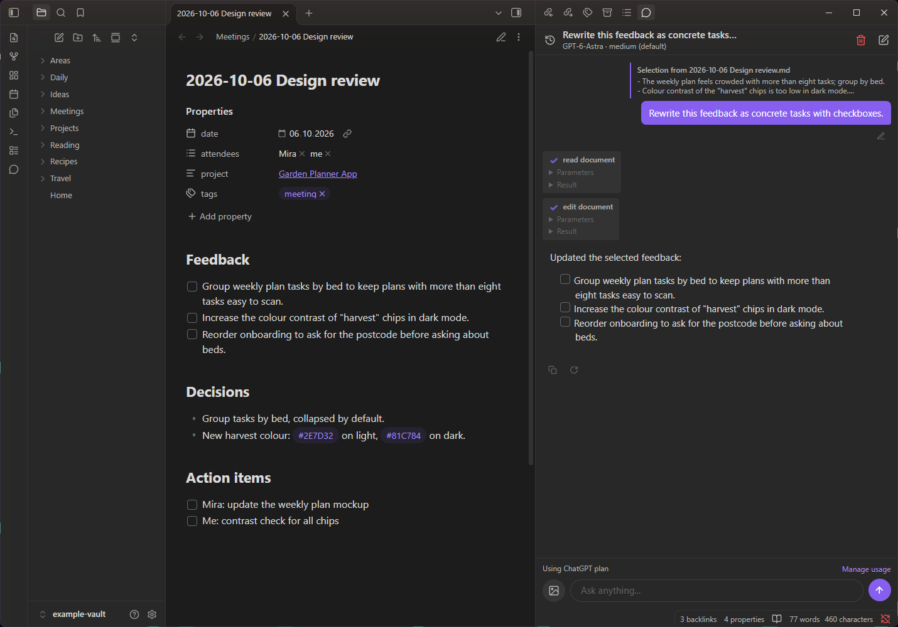
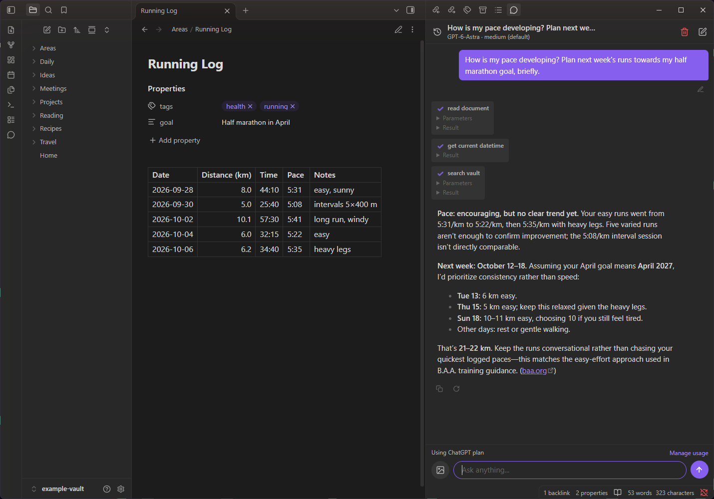

# Chatting with AI Minus

<!-- Belongs here: what the plugin does, how to install, set up and
troubleshoot it (also on a phone), and what users need to know about
privacy and network use. Elsewhere: how it works inside (docs/arc42), how
to develop it (AGENTS.md). Kept as a comment: this README is the plugin's
page in Obsidian's community directory. -->

An AI chat for Obsidian that can read, search, create and edit your notes.
It works the same on desktop, iPhone, iPad and Android, with one
difference: on phones, answers on the ChatGPT plan appear when complete
instead of as they're written.

**Needs an account:** an Anthropic or OpenAI API key (paid API access), or
a ChatGPT plan to sign in with. Voice needs an OpenAI API key (or, unofficially
and at your own risk, a ChatGPT plan; see [Voice](#voice)). Your
messages and the notes the AI reads go to that provider (see
[Privacy and network use](#privacy-and-network-use)).

## Features

- **Three providers:** Anthropic (API key), OpenAI (API key), or sign in
  with your ChatGPT account.
- **Works with your vault:** the AI can read, search, list, create, edit,
  rename and trash notes, change frontmatter, find notes by tags and
  properties ("my #project notes that are active, by due date"), find
  backlinks, read web pages, read and edit
  canvases, look at images and canvases, and ask you when something is
  unclear.
- **Streaming:** answers appear as they're written; **Stop** ends one
  early.
- **Edit, regenerate, copy:** edit an earlier message and run it again,
  regenerate the last answer, copy an answer as Markdown.
- **Web search and thinking level:** turn web search on in the settings,
  and pick how much the model thinks, where the model offers levels.
- **Add to a running answer:** type and send while the AI is still
  working: your message joins the running task (shown as *Queued* until
  the AI takes it in) instead of waiting. Stop is the button while the
  box is empty.
- **Follow the AI's edits:** when the AI changes a note or canvas, it
  opens next to the chat at the changed spot (changed text highlighted,
  changed canvas cards selected and centered), in one reused tab so your
  own tab stays as it is; that tab closes with Obsidian. On by default; switch it with the eye button in the chat
  header or in the settings. Ask "show me …" and the AI opens a note at a
  passage or a canvas at a card for you.
- **Undo an answer's changes:** an answer that changed files ends in a
  row naming them; **Undo** puts them back as they were before it
  (created files go to the trash, renamed ones get their name back,
  deleted ones return). If a file changed since, you're asked first.
  Available until Obsidian closes.
- **Enter sends message:** on by default (Shift+Enter starts a new line).
  Turn it off in the settings to make Enter start a new line; then send
  with the send button or Ctrl+Enter (Cmd+Enter on a Mac).
- **Conversations:** start a new chat at any time; switch, rename and
  delete earlier chats from the history list. The chat that was open comes
  back after a restart.
- **Selection scope:** select text in a note and choose *Send selection to
  chat*; in that note the AI can change only the selected text, and the
  message shows the selection it worked on.
- **Images:** attach or paste up to four images per message, for models
  that accept them.
- **Current models:** model lists are loaded from each provider when you
  open the settings, and kept for a day.
- **Voice:** talk with the assistant in the current chat and hear the
  answer (see [Voice](#voice)).
- **Leaving the app on a phone:** an interrupted answer continues when
  you come back (see [On a phone](#on-a-phone)).

## Screenshots

| | |
|---|---|
|  |  |
| **Edit a note:** a new quote in the budget table, the total updated, the task ticked off. | **Create a note:** a packing checklist from the trip plans, linked and opened. |
|  |  |
| **Selection scope:** only the selected feedback becomes tasks. | **Ask about your notes:** a running log read, with web search for the plan. |

## Commands

From the command palette:

- **Open chat**, **New chat**
- **Copy conversation transcript to clipboard**, **Clear conversation**
- **Chat about this note** (also in the file menu) and **Send selection
  to chat** (also in the editor's right-click menu): both start a new chat.
- **Check device capabilities (voice, streaming)** and **Copy debug log**:
  see [Troubleshooting](#troubleshooting).

The ribbon icon opens the chat; right-click it for Open chat, New chat,
Chat about active note and Copy transcript.

## Install

The plugin isn't in Obsidian's community plugins yet. It needs Obsidian
1.13.0 or later; install it in one of these ways:

- **With BRAT** (updates itself; desktop and phone): install the
  community plugin **BRAT**, run its command *Add a beta plugin for
  testing* and enter `thomas0schierl/chatting-with-ai-minus`.
- **By hand:** download `main.js`, `manifest.json` and `styles.css` from
  the [latest release](https://github.com/thomas0schierl/chatting-with-ai-minus/releases/latest)
  into `<vault>/.obsidian/plugins/chatting-with-ai-minus/`.
- **From source:** `npm install`, then `npm run build`, and copy the same
  three files.

Then enable **Chatting with AI Minus** under **Settings → Community
plugins**.

## Set up

1. Open **Settings → Chatting with AI Minus** and pick a provider.
2. Paste an API key, or for ChatGPT click **Continue with ChatGPT**:
   1. Click **Open sign-in page** and sign in to ChatGPT in your browser.
   2. The browser then lands on a `http://127.0.0.1:…` page that won't
      load. Copy that page's full address, paste it into the plugin and
      click **Connect**.
3. Open the chat from the ribbon icon or the command palette.

ChatGPT sign-in uses OpenAI's "Sign in with ChatGPT" for open-source apps,
which is still a preview. Chats then count against your ChatGPT plan,
shown as **Using ChatGPT plan** above the chat input; **Manage usage**
there or in the settings opens your usage limits.

## Voice

Voice uses OpenAI GPT-Live and needs an **OpenAI API key**, whichever
provider you chat with (the ChatGPT sign-in doesn't include audio). Enter
it under **Settings → Chatting with AI Minus → Voice** (it is the same key
as for the OpenAI provider) and use **Check access** to see whether your
account can use `gpt-live-1`. OpenAI bills voice at **$0.05 per minute**
of conversation, silence included, until you end it; the chat model's
answers are billed as usual.

**Voice with the ChatGPT plan (unofficial, at your own risk):** under
**Voice → Voice route** you can choose **ChatGPT plan** instead of an API
key. It is off by default, and you have to accept a warning first. This
route signs in as OpenAI's Codex app and uses Codex's internal,
undocumented voice service with your ChatGPT plan. OpenAI doesn't offer
or approve this for other apps: it may stop working at any time, and
OpenAI could treat it as a breach of its terms and restrict or suspend
the ChatGPT account you use. Use it only if you accept that risk; the
route with an OpenAI API key has none of it.

- **Start:** the voice button (a circle with sound-wave bars) sits where
  Send is. It shows while the input is empty, nothing is attached, no
  answer is running and the AI isn't waiting for your answer to a
  question.
- **During a call** the voice bar replaces the input row: the microphone
  button (tap to mute) or, with *Hold to talk*, the button you hold while
  speaking; a line showing your current words, or else whether the
  assistant is listening, working or speaking; and a red **✕** to end.
- **Hands-free or hold to talk:** choose under **Voice → Microphone**.
- **In the chat:** your requests and the answers appear as chat
  messages, tool steps included. Small talk the voice handles itself is
  only heard.
- **Say more while it works:** what you add is passed to the running task
  instead of starting over. If the AI asks you a question, answer it by
  voice (or end the call and type).
- **Ending:** the **✕**, switching or starting a chat, Clear, or closing
  the chat panel.

Voice conversations are tested on desktop and Android (including a
Bluetooth headset); iOS isn't verified yet.

## On a phone

- **Getting the plugin there:** with BRAT on the phone (see
  [Install](#install)), or let a sync copy the plugin folder, e.g.
  Obsidian Sync with **Installed community plugins** on. Then enable the
  plugin on the phone.
- **Per device:** API keys and sign-ins are kept in the device's
  keychain, so enter them on each device. Chats (`chat-state.json`) stay
  on the device; the plugin doesn't sync them.
- **Voice:** the phone asks for microphone access the first time. If you
  denied it, allow Obsidian's microphone in the system settings. Keep the
  chat panel open during a call. Billing runs until you end the call, or
  until it ends after 60 s in the background.
- **Screen stays on:** while an answer is generated and during a voice
  call, the screen doesn't go to sleep (where the phone allows it).
- **No word-by-word answers with the ChatGPT plan:** they appear when
  complete; Stop before that leaves a "Stopped." note.
- **Leaving the app:** nothing progresses while Obsidian is in the
  background. When you come back, an interrupted answer is requested
  again ("Resuming…"), which costs its tokens again. If the phone closed
  Obsidian meanwhile, the chat offers **Continue**; it never continues by
  itself. Voice mutes the microphone while you're away and reconnects
  when you return.

## Troubleshooting

- **Check device capabilities** shows what this device supports
  (microphone, live audio, streaming) in a window you can copy.
- To send a log: turn on **Debug log** in the settings, repeat the
  problem, then **Copy debug log** (command, or **Copy** in the settings)
  and paste it into a message. **Clear** deletes it.

## Privacy and network use

The plugin connects only to these services, and only for what you use:

| Service | What for |
|---|---|
| `api.anthropic.com` | Chat and model list, with an Anthropic API key. |
| `api.openai.com` | Chat and model list with an OpenAI API key or the ChatGPT sign-in; voice (GPT-Live) with an OpenAI API key. |
| `auth.openai.com` | Signing in with ChatGPT and renewing that sign-in; the separate Codex sign-in for voice with the ChatGPT plan. |
| `chatgpt.com` | Only if you chose voice with the ChatGPT plan (unofficial, see [Voice](#voice)): starting a voice call. |
| `api.github.com` | With the ChatGPT sign-in or voice on the ChatGPT plan, at most once a day: the latest Codex CLI version number, which OpenAI's model list and that voice route need. Nothing about you is sent. |
| Web pages the AI reads | When the AI reads a web page (a link you gave, or one its web search found), your device loads that address, as a browser would. |

Web search, when turned on, runs at the provider; the plugin itself
doesn't contact search engines. There is no telemetry and no tracking.

- **Sent to the provider:** your messages and attached images, the vault
  name, the number of notes, the active note's path, selected text, and
  whatever note content and images the AI reads with its tools during that
  turn. Nothing is sent in the background, and there is no vault index.
- **Voice:** while a voice conversation runs, your microphone audio and
  the last few chat messages (as text) go to OpenAI.
- **API keys and ChatGPT tokens:** stored in your OS keychain, never in
  plugin files.
- **Chat history:** all conversations are stored locally in
  `chat-state.json` in the plugin folder, with a copy in
  `chat-state.next.json` so an interrupted save loses nothing; deleting a
  conversation removes it from both.
- **Debug log:** off by default. While on, `debug.log` in the plugin
  folder records requests, errors and events, including your messages
  (never keys).
- **Check device capabilities:** with your keys, it sends short test
  requests to Anthropic and OpenAI and opens a GPT-Live session for a
  moment, which costs a little.

## Credits and licence

MIT licence. Forked from [Chatting with AI](https://github.com/o1xhack/obsidian-chatting)
by Yuxiao (o1xhack), which derives from [Obsidian Chat](https://github.com/omarshahine/obsidian-chat)
by Omar Shahine. Their copyright notices are kept in [LICENSE](LICENSE).
